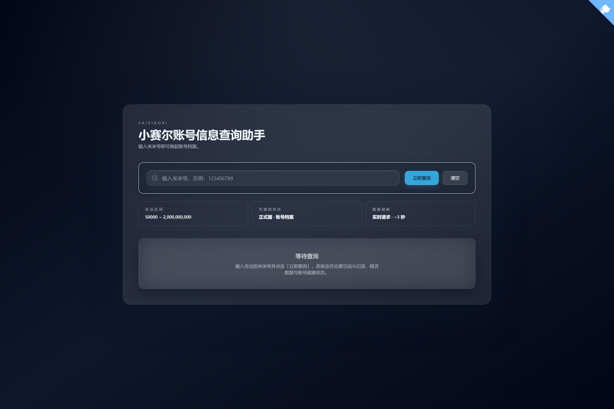

<p align="center">
  
</p>

<h1 align="center">赛小息 Saixiaoxi</h1>

<p align="center">
  <strong>你的赛尔号账号信息查询助手</strong>
</p>

<p align="center">
单例版本
</p>

<p align="center">
  
  
  
  
  
</p>

---

## 快速开始

### 1. 启动后端

```bash
cd backend

# 安装 uv
# Windows:
powershell -c "irm https://astral.sh/uv/install.ps1 | iex"
# macOS/Linux:
curl -LsSf https://astral.sh/uv/install.sh | sh

# 同步依赖
uv sync

# 配置环境变量
cp .env.example .env
# 编辑 .env 文件，设置游戏服务器账号等配置

# 启动后端服务
uv run python app.py
# 或使用开发模式（支持热重载）
uv run uvicorn app:app --reload --host 0.0.0.0 --port 8000
```

### 2. 启动前端

```bash
cd frontend
npm install
npm run dev
# 构建生产版本
npm run build
```

---

## 访问地址一览

| 环境 | 前端界面 | 后端 API | 文档 / 健康检查 |
| ---- | ---------- | ---------- | ---------------- |
| **开发环境** | [http://localhost:5173](http://localhost:5173) | [http://localhost:8000](http://localhost:8000) | [Swagger Docs](http://localhost:8000/docs) / [Health](http://localhost:8000/health) |

---

## 项目截图



---

## 配置说明

### 后端配置（`.env`）

* 游戏服务器地址与端口
* 服务账号凭据
* API 配置、日志级别等

> 模板文件：`backend/.env.example`

### 前端配置（`.env.production`）

* 后端 API 地址（生产环境使用）

> 模板文件：`frontend/.env.production.example`

---

## 项目结构

```
saixiaoxi/
├── backend/              # 后端服务（FastAPI）
│   ├── src/             # 源代码
│   │   ├── core/       # 核心功能（加密、认证）
│   │   ├── network/    # 网络通信
│   │   ├── api/        # API 路由
│   │   ├── config/     # 配置
│   │   └── utils/      # 工具函数
│   ├── app.py          # 应用入口
│   └── pyproject.toml  # Python 依赖
│
├── frontend/            # 前端应用（Vue 3 + TypeScript）
│   ├── src/            # 源代码
│   │   ├── components/ # Vue 组件
│   │   ├── api/        # API 调用
│   │   └── types/      # TypeScript 类型
│   └── package.json    # Node 依赖
│
├── README.md           # 项目文档
└── .gitignore
```

---

## 相关项目

[UnitySeer-Config](https://github.com/oldml/UnitySeer-Config)
《赛尔号》Unity 客户端配置文件的结构化数据存档，每小时自动检查更新（周五频率为每 10 分钟一次）。

[SeerTaiwanRoutineHelper](https://github.com/oldml/SeerTaiwanRoutineHelper)
赛尔号台服护肝小助手，基于PySide6-Fluent-Widgets 构建的现代化客户端，采用 Fluent Design 设计语言，提供优雅的界面和自动化功能。

---

## 免责声明

本项目仅供学习和研究使用，请勿用于商业用途。使用本工具产生的任何后果由使用者自行承担。

---

## License

本项目采用 [MIT License](LICENSE) 开源许可证。

```
MIT License - Copyright (c) 2025 Adai
```

---
